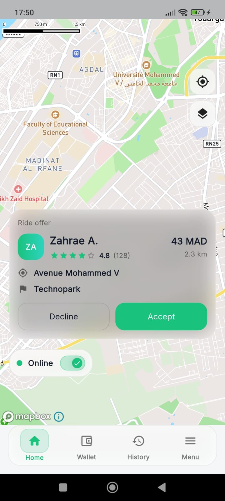
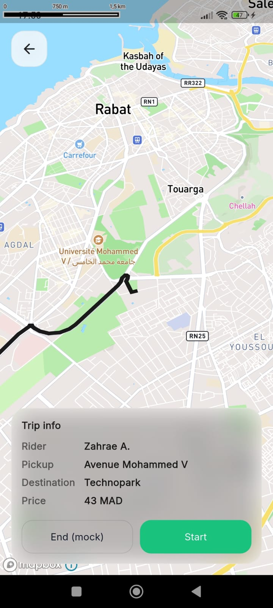
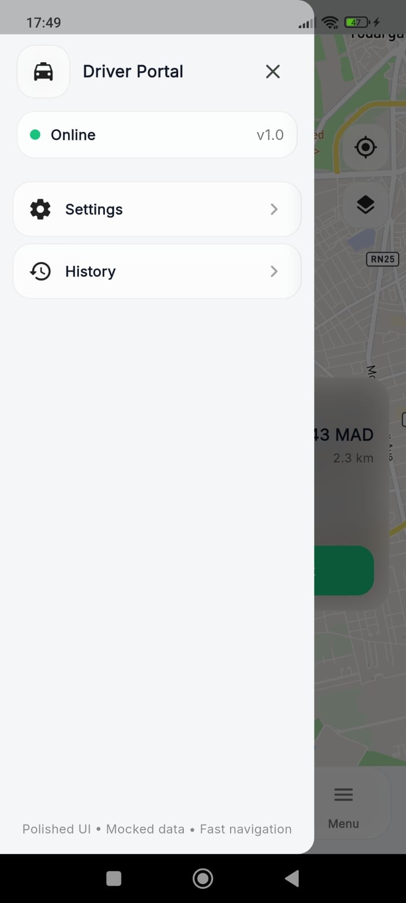
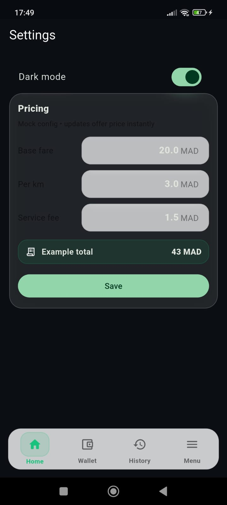
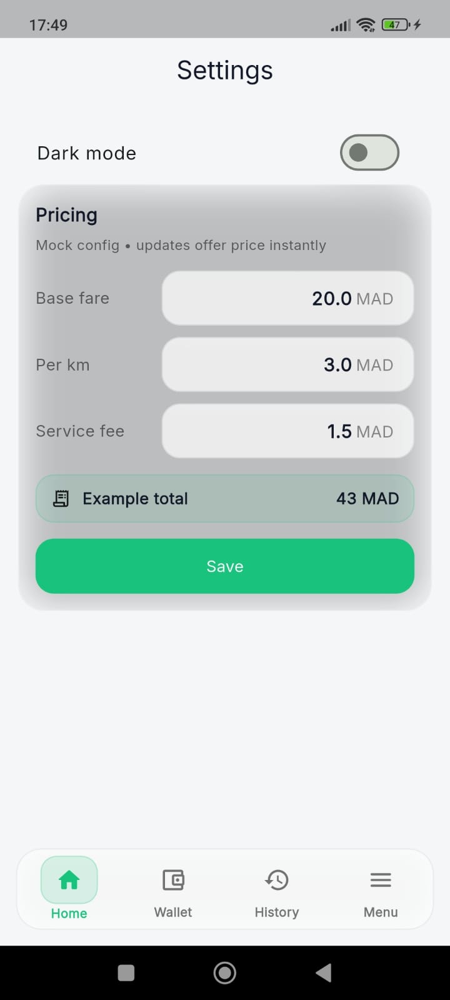

# Driver Portal (Flutter) — Interactive APK UI

Front-end only **Driver Portal** built in **Flutter** for a UI assessment.  
No backend. Everything is mocked. Focus is on clean navigation + premium UI polish.

---

## What’s Included
## Screenshots

### Home


### Route


### Menu / Drawer


### Settings


### Dark settings


### Home
- **Mapbox map** as the main view
- **Online / Offline toggle**
- Premium glassy UI overlays (buttons, cards)
- Ride offers are mocked (UI only)

### Route
- Mapbox map showing **pickup + destination**
- Visual route line + markers
- Bottom trip info card (rider name, price, etc.)

### Navigation
- Shopify-style **bottom navbar**
- **Drawer menu** (hamburger) with Settings + History
- Wallet tab is **UI only** (no route)

### Settings
- Mock configuration style screen (fixed price displayed as adjustable)

### History
- Mock trips list (UI only)

---

## Tech Stack
- Flutter
- Riverpod (state management)
- GoRouter (navigation)
- Mapbox Maps Flutter SDK

---

## Requirements
- Flutter SDK installed
- Android SDK + Android device (recommended)
- Mapbox access token (`pk...`)

---

## Setup

### 1) Install dependencies
```bash
flutter pub get
```
2) Add Mapbox token (required)

This project sets the token in main.dart.

Open: lib/main.dart and update:
```bash
WidgetsFlutterBinding.ensureInitialized();
MapboxOptions.setAccessToken('pk.YOUR_TOKEN_HERE');
```

Use a public token starting with pk. (not sk.).

3) Run the app

List devices:
```bash
flutter devices
```

Run on a device:
```bash
flutter run -d <device_id>
```
Build APK (Deliverable)

Debug APK:
``` bash
flutter build apk --debug
```

Release APK:
```bash
flutter build apk --release
```
Project Structure
lib/
  app/                  # app root (App widget), router, theme
  shell/                # bottom navbar + drawer
  features/
    home/               # map + online toggle + offer UI
    route/              # route map + trip info
    history/            # history UI
    settings/           # settings UI
  shared/               # reusable UI widgets (cards, etc.)
  state/                # Riverpod providers (app state + theme mode)
android/
  app/src/main/         # Android config

APK output:

build/app/outputs/flutter-apk/app-debug.apk

build/app/outputs/flutter-apk/app-release.apk
